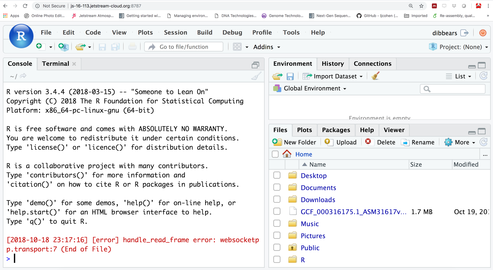

# Starting R Studio Server

R Studio server launches [R Studio](https://www.rstudio.com/products/rstudio/#Server) in your web browser. This also enables visualization and interaction with files on your instance.

We have already installed R Studio on your instance ('DIBSI 2018 workshop' image).

To check whether this is working, enter:
```
echo My RStudio Web server is running at: http://$(hostname):8787/
```
(Otherwise, install with [instructions here](https://angus.readthedocs.io/en/2018/jetstream-bioconda-config.html.)

This will display the web address where R Studio is being served to. But first, we will have to change the password on your instance:

```
sudo passwd $USER
```
Set the password to something simple! (You will not need this again once you delete the instance.)

Now go to that Web address in your Web browser, and log in with the username and password from above.




